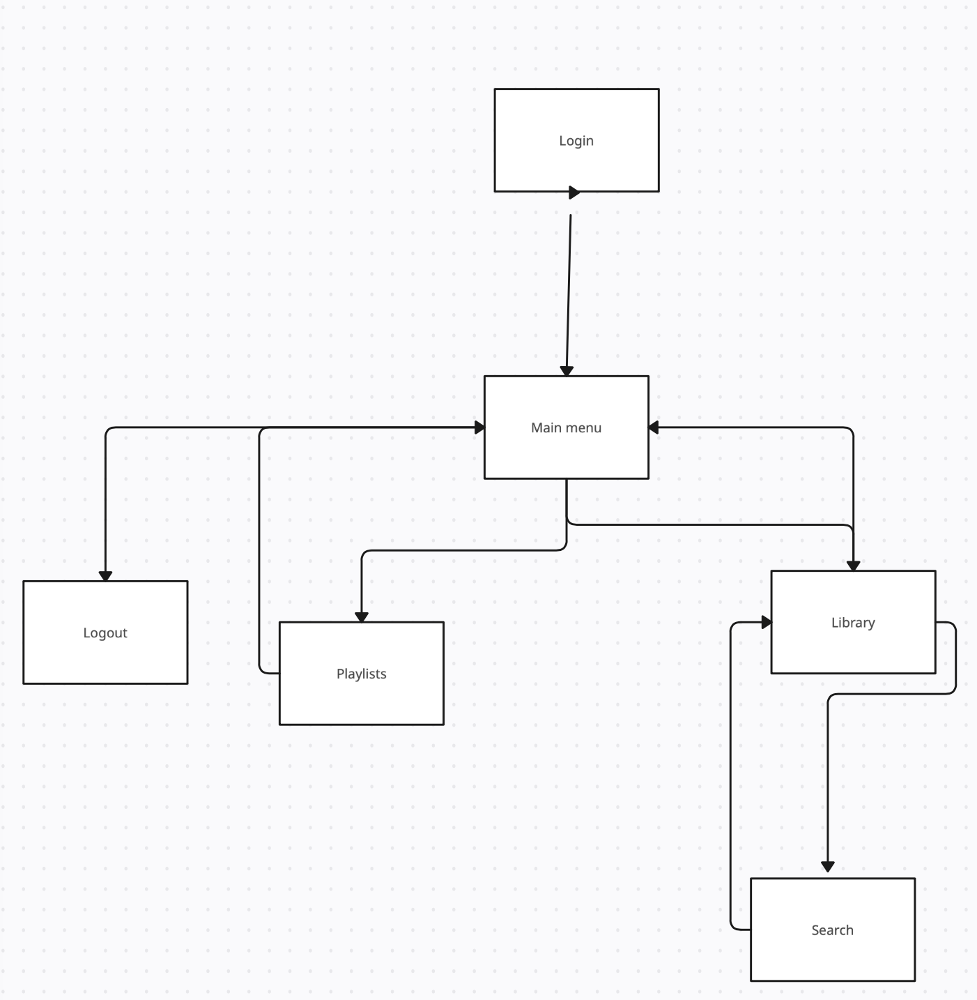
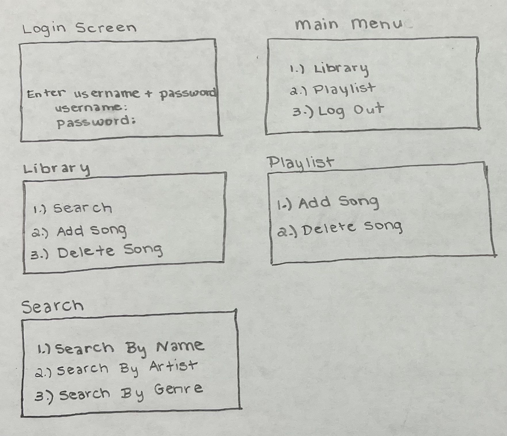

# Harmony Mix
Authors:  
[Jordan Ayvazian](https://github.com/jorbo)
[Ananya Sood](https://github.com/ananyasood2)
[Mani Ansari](https://github.com/maniansari)
[Ridhima Inukurti](https://github.com/ridhimainukurti)  

## Project Description
 * This idea is interesting to us because we all like music and wanted to create a console where we create a playlist and also get recommended songs based on the genres/music that we are interested in.
 * The language that we are planning on using is c++ and the IDE we are using is vscode.
 * The main inputs for our project will be the song name, playlist name, genre, username and password, and search (in the playlist) and in terms for our output, the user would be able to have a playlist that they can modify/edit to change their personal collection of songs. As well as display a list of songs in the users library and which songs are in which playlist.
 * Some features we are planning to implement are creating a playlist, adding music to the playlist, searching for songs, recommendations based on genre.

 > ## Phase II
## User Interface Specification
 > Include a navigation diagram for your screens and the layout of each of those screens as desribed below. For all the layouts/diagrams, you can use any tool such as PowerPoint or a drawing program. (Specification requirement is adapted from [this template](https://redirect.cs.umbc.edu/~mgrass2/cmsc345/Template_UI.doc))

### Navigation Diagram

### Screen Layouts

## Class Diagram

+ The UserInterface class has a user and deals with the keyboard actions.
+ The User class has a Library and can hold multiple playlists.
+ The Library class holds many Songs and manages adding and removing them from itself.
+ The Playlist class holds many Songs and manages adding and removing them from itself.
+ The Song class has a name, artist name, genre, and file path.

 > ## Phase III
## SOLID UML Diagram

Update 1 Add Db Class:
The solid principles we used when creating this class was the single responsability principle and the open-close principle. We applied this by removing the need for the Playlist and Library class to deal with any of the file I/O and seperated that functionality into its own class Db. If needed the Db class is written in a way so that it can be extended to use more than just JSON files. This change helps us write better code by having a single source of bugs when dealing with files and allows up to keep the code cleaner.  

Update 2 Seperate Display Function:
The solid principles we used when updating this class was the single responsability principle and the open-close principle. We applied the single responsability principle by seperating all of the menu options into seperate functions. We applied the open-close principle by enabling us to extend the display class without having to modify a much larger display function. This change helps us write better code by keeping the display functions short and readable.

 > BEFORE the meeting you should do the following:
 > * Update your class diagram from Phase II to include any feedback you received from your TA/grader.
 > * Considering the SOLID design principles, reflect back on your class diagram and think about how you can use the SOLID principles to improve your design. You should then update the README.md file by adding the following:
 >   * A new class diagram incorporating your changes after considering the SOLID principles.
 >   * For each update in your class diagram, you must explain in 3-4 sentences:
 >     * What SOLID principle(s) did you apply?
 >     * How did you apply it? i.e. describe the change.
 >     * How did this change help you write better code?
 > * Perform a new sprint plan like you did in Phase II.
 > * You should also make sure that your README file (and Project board) are up-to-date reflecting the current status of your project and the most recent class diagram. Previous versions of the README file should still be visible through your commit history.
 
> During the meeting with your reader you will discuss: 
 > * How effective your last sprint was (each member should talk about what they did)
 > * Any tasks that did not get completed last sprint, and how you took them into consideration for this sprint
 > * Any bugs you've identified and created issues for during the sprint. Do you plan on fixing them in the next sprint or are they lower priority?
 > * What tasks you are planning for this next sprint.

 
 > ## Final deliverable
 > All group members will give a demo to the reader during lab time. ou should schedule your demo on Calendly with the same reader who took your second scrum meeting. The reader will check the demo and the project GitHub repository and ask a few questions to all the team members. 
 > Before the demo, you should do the following:
 > * Complete the sections below (i.e. Screenshots, Installation/Usage, Testing)
 > * Plan one more sprint (that you will not necessarily complete before the end of the quarter). Your In-progress and In-testing columns should be empty (you are not doing more work currently) but your TODO column should have a full sprint plan in it as you have done before. This should include any known bugs (there should be some) or new features you would like to add. These should appear as issues/cards on your Project board.
 > * Make sure your README file and Project board are up-to-date reflecting the current status of your project (e.g. any changes that you have made during the project such as changes to your class diagram). Previous versions should still be visible through your commit history. 
 
 ## Screenshots
 > Screenshots of the input/output after running your application
 ## Installation/Usage
 > Instructions on installing and running your application
 ## Testing
 > How was your project tested/validated? If you used CI, you should have a "build passing" badge in this README.
 
