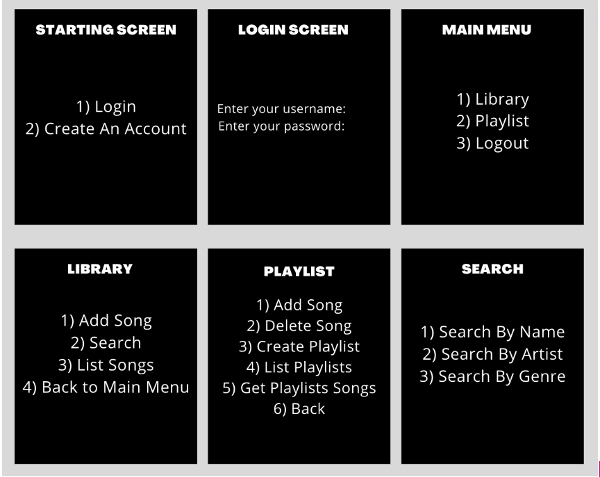
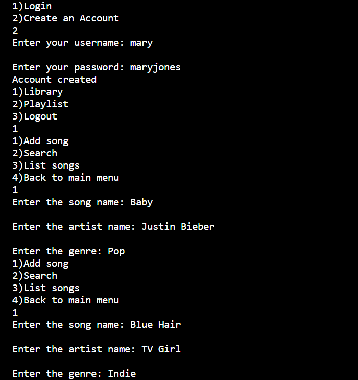
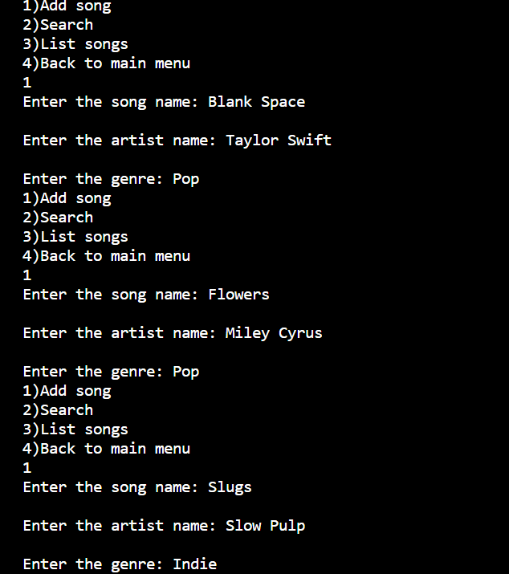
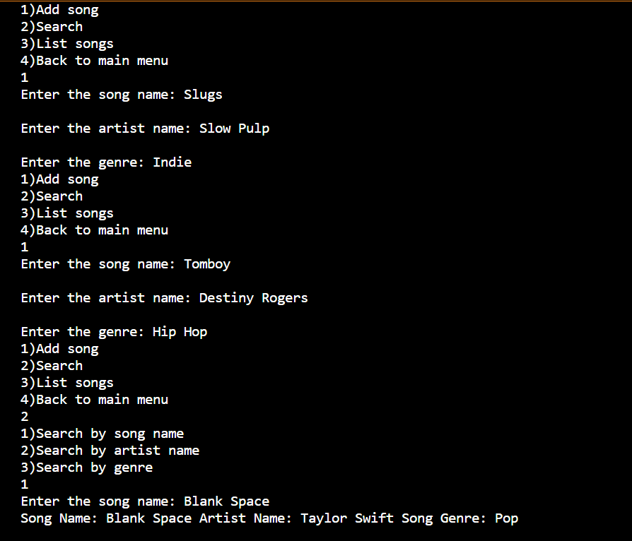
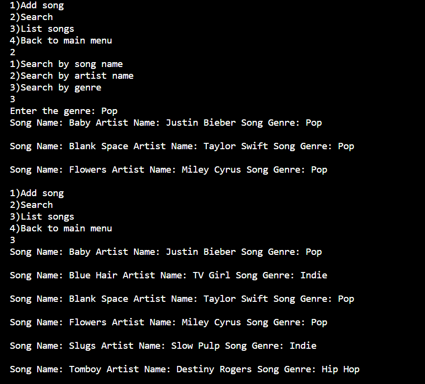
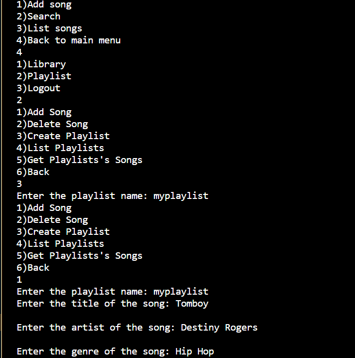
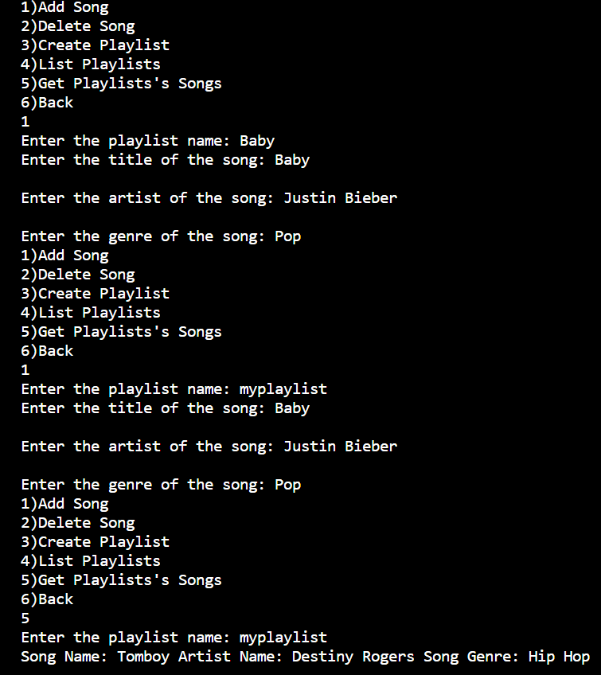
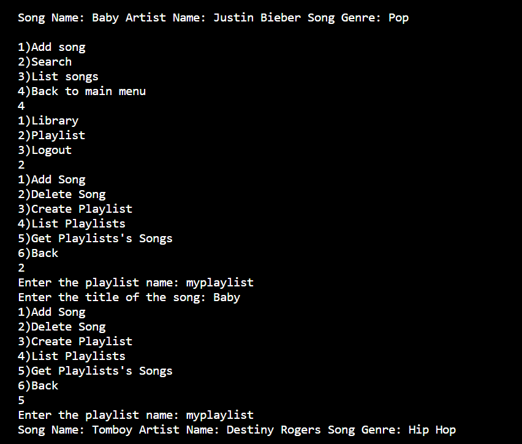
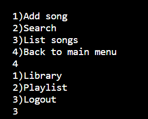
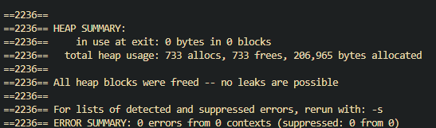

# Harmony Mix
Authors:  
[Jordan Ayvazian](https://github.com/jorbo)
[Ananya Sood](https://github.com/ananyasood2)
[Mani Ansari](https://github.com/maniansari)
[Ridhima Inukurti](https://github.com/ridhimainukurti)  

## Project Description
 * This idea is interesting to us because we all like music and wanted to create a console where we create a playlist and also get recommended songs based on the genres/music that we are interested in.
 * The language that we are planning on using is c++ and the IDE we are using is vscode.
 * The main inputs for our project will be the song name, playlist name, genre, username and password, and search (in the playlist) and in terms for our output, the user would be able to have a playlist that they can modify/edit to change their personal collection of songs. As well as display a list of songs in the users library and which songs are in which playlist.
 * Some features we are planning to implement are creating a playlist, adding music to the playlist, searching for songs, recommendations based on genre.

 > ## Phase II
## User Interface Specification
 > Include a navigation diagram for your screens and the layout of each of those screens as desribed below. For all the layouts/diagrams, you can use any tool such as PowerPoint or a drawing program. (Specification requirement is adapted from [this template](https://redirect.cs.umbc.edu/~mgrass2/cmsc345/Template_UI.doc))

### Navigation Diagram

### Screen Layouts


## Class Diagram
![diagram of our classes needed](http://www.plantuml.com/plantuml/png/fLPTRzii5Bxth-3DHMI_JQLUUrlLRjEcJcqLgTjk8s98WcP313XhLtM_VM1y304lovOhu-SSdlCDN2cDfMwREbFV6DzYYHjKrLYfQwqbMxQQtbI2Fx0V55radG1zKLIYv-mSjMR1SKDBf8mkNnjeWzM6ahbH-oua2GGrMqeidqfqwnO6sjRugMPAgnBjQAM5V3tlaSli3DLYpNZkJHWlbExvfZEq1HFxWg94Io5gjr-qElV0cke5q1aON7C2e4i5uAIJaB8SyRMI56iAI0vxxbF73SbEC3BiMU2g4YtN9mIA2NaGVFrPz9dDbVahaS52SuJML5CBVf2Y2LKziGakTjEp9z4bdWPaXwtFRu-d0X2uNlecj5nT4rhL-_qcn58RqWXSKowfBsv7a1Um2DjuDa8mW_tmks8rdMEz0QHm_N8_qbpNm9P8FXhEVP0mPPFI-MH0YfiIJOLR5P1DBJwPgEq--otBhxXkgS75bagiXVplJLvlr5ufPaY6Y6yWI2ZCvP1JFvLMtNOvD4qHh2EjmdLCt8jJA_JTe2YMrUPj5sMNbhY6gMgGmxGu1KhqNMQxceqJatPRimgxfWpTz8CbQIDsT7nSqe6szRJxLLuacSDclhbYQqu9ObmZLhZvDCb_roKVXkivE1OZ5X14ZNqsxEtgaaufHEvdEJzgK9DZ18844qb3ZxTbc1Wm6WIcBWUhFX0m1-CmIFf9G5Ft3VfaW-KUWLWvbQwELIMQXdAI_tQm-pzVEcMJVZ1WAAklAYVqqLSsk2rlkAPoXIiwN9jbX__zlHYs1w3PsRwHlF2PkxMtQ7AIp10R8CK0ioJeV-jTKe0xpFWTvUtfJ7sOfv75VN4IcwcK6yBtIrkUi7aHMRuoYC8xwflIw9aVy_q92ykse8-sPF4z7b_Nfz_xqOFbW45b7cqBdRnZx8POEJsn25aeirveCMmTspb3yHqEDJ6YXqF7fJjTdP6L5CtHPYB1dyxaHJzXOxJmf3iGVBpxs1TF7DxnH6DFi7-jGUpFgJmlMJS_v-UNPWhy6iwk3fWqc3zD38uc5nD_IC4YaWyzeZ7ZAkkP3Ylj7wdM0OjaLvIJjgb_0G00)
+ The UserInterface class has a user and deals with the keyboard actions.
+ The User class has a Library and can hold multiple playlists.
+ The Library class holds many Songs and manages adding and removing them from itself.
+ The Playlist class holds many Songs and manages adding and removing them from itself.
+ The Song class has a name, artist name, genre, and file path.

 > ## Phase III
## SOLID UML Diagram


Update 1 Add Db Class:
The solid principles we used when creating this class was the single responsability principle and the open-close principle. We applied this by removing the need for the Playlist and Library class to deal with any of the file I/O and seperated that functionality into its own class Db. If needed the Db class is written in a way so that it can be extended to use more than just JSON files. This change helps us write better code by having a single source of bugs when dealing with files and allows up to keep the code cleaner.  

Update 2 Seperate Display Function:
The solid principles we used when updating this class was the single responsability principle and the open-close principle. We applied the single responsability principle by seperating all of the menu options into seperate functions. We applied the open-close principle by enabling us to extend the display class without having to modify a much larger display function. This change helps us write better code by keeping the display functions short and readable.
 
 > ## Final deliverable
 > All group members will give a demo to the reader during lab time. ou should schedule your demo on Calendly with the same reader who took your second scrum meeting. The reader will check the demo and the project GitHub repository and ask a few questions to all the team members. 
 > Before the demo, you should do the following:
 > * Complete the sections below (i.e. Screenshots, Installation/Usage, Testing)
 > * Plan one more sprint (that you will not necessarily complete before the end of the quarter). Your In-progress and In-testing columns should be empty (you are not doing more work currently) but your TODO column should have a full sprint plan in it as you have done before. This should include any known bugs (there should be some) or new features you would like to add. These should appear as issues/cards on your Project board.
 > * Make sure your README file and Project board are up-to-date reflecting the current status of your project (e.g. any changes that you have made during the project such as changes to your class diagram). Previous versions should still be visible through your commit history. 
 
 ## Screenshots










All the inputs from the user are entered through the terminal and all the outputted information in regards to the playlist and the playlist's songs are also outputted inside the terminal as well.
 ## Installation/Usage
 ### Installation
 ```
 git clone https://github.com/cs100/final-project-jayva001-mansa015-rinuk001-asood010.git
 cd final-project-jayva001-mansa015-rinuk001-asood010.git
 git submodule update --init --recursive
 cmake .
 make
 ./harmonymix
 ```
 ## Testing
We used google unit test to check for behavior of our functions and Valgrind to check for memory leaks or memory issues.
 

