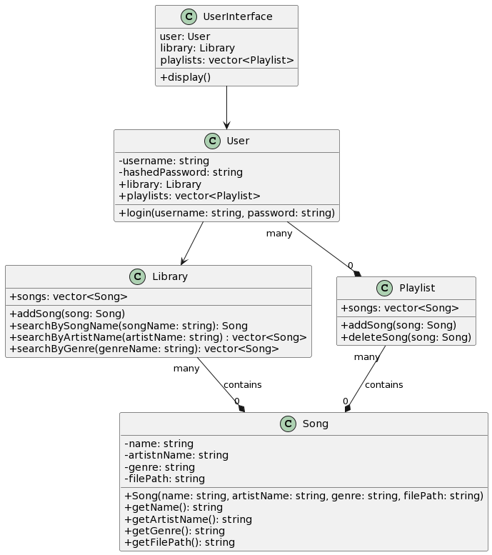

# Harmony Mix
Authors:  
[Jordan Ayvazian](https://github.com/jorbo)
[Ananya Sood](https://github.com/ananyasood2)
[Mani Ansari](https://github.com/maniansari)
[Ridhima Inukurti](https://github.com/ridhimainukurti)  

## Project Description
 * This idea is interesting to us because we all like music and wanted to create a console where we create a playlist and also get recommended songs based on the genres/music that we are interested in.
 * The language that we are planning on using is c++ and the IDE we are using is vscode.
 * The main inputs for our project will be the song name, playlist name, genre, username and password, and search (in the playlist). 
 * Some features we are planning to implement are creating a playlist, adding music to the playlist, searching for songs, recommendations based on genre.

 > ## Phase II
## User Interface Specification
 > Include a navigation diagram for your screens and the layout of each of those screens as desribed below. For all the layouts/diagrams, you can use any tool such as PowerPoint or a drawing program. (Specification requirement is adapted from [this template](https://redirect.cs.umbc.edu/~mgrass2/cmsc345/Template_UI.doc))

### Navigation Diagram

### Screen Layouts
> Include the layout of each of your screens. The layout should describe the screen’s major components such as menus and prompts for user inputs, expected output, and buttons (if applicable). Explain what is on the layout, and the purpose of each menu item, button, etc. If many screens share the same layout, start by describing the general layout and then list the screens that will be using that layout and the differences between each of them.

## Class Diagram

+ The UserInterface class has a user and deals with the keyboard actions.
+ The User class has a Library and can hold multiple playlists.
+ The Library class holds many Songs and manages adding and removing them from itself.
+ The Playlist class holds many Songs and manages adding and removing them from itself.
+ The Song class has a name, artist name, genre, and file path.

 > ## Phase III
 > You will need to schedule a check-in for the second scrum meeting with the same reader you had your first scrum meeting with (using Calendly). Your entire team must be present. This meeting will occur on Zoom and should be conducted by Wednesday of week 8.
 
 > BEFORE the meeting you should do the following:
 > * Update your class diagram from Phase II to include any feedback you received from your TA/grader.
 > * Considering the SOLID design principles, reflect back on your class diagram and think about how you can use the SOLID principles to improve your design. You should then update the README.md file by adding the following:
 >   * A new class diagram incorporating your changes after considering the SOLID principles.
 >   * For each update in your class diagram, you must explain in 3-4 sentences:
 >     * What SOLID principle(s) did you apply?
 >     * How did you apply it? i.e. describe the change.
 >     * How did this change help you write better code?
 > * Perform a new sprint plan like you did in Phase II.
 > * You should also make sure that your README file (and Project board) are up-to-date reflecting the current status of your project and the most recent class diagram. Previous versions of the README file should still be visible through your commit history.
 
> During the meeting with your reader you will discuss: 
 > * How effective your last sprint was (each member should talk about what they did)
 > * Any tasks that did not get completed last sprint, and how you took them into consideration for this sprint
 > * Any bugs you've identified and created issues for during the sprint. Do you plan on fixing them in the next sprint or are they lower priority?
 > * What tasks you are planning for this next sprint.

 
 > ## Final deliverable
 > All group members will give a demo to the reader during lab time. ou should schedule your demo on Calendly with the same reader who took your second scrum meeting. The reader will check the demo and the project GitHub repository and ask a few questions to all the team members. 
 > Before the demo, you should do the following:
 > * Complete the sections below (i.e. Screenshots, Installation/Usage, Testing)
 > * Plan one more sprint (that you will not necessarily complete before the end of the quarter). Your In-progress and In-testing columns should be empty (you are not doing more work currently) but your TODO column should have a full sprint plan in it as you have done before. This should include any known bugs (there should be some) or new features you would like to add. These should appear as issues/cards on your Project board.
 > * Make sure your README file and Project board are up-to-date reflecting the current status of your project (e.g. any changes that you have made during the project such as changes to your class diagram). Previous versions should still be visible through your commit history. 
 
 ## Screenshots
 > Screenshots of the input/output after running your application
 ## Installation/Usage
 > Instructions on installing and running your application
 ## Testing
 > How was your project tested/validated? If you used CI, you should have a "build passing" badge in this README.
 
